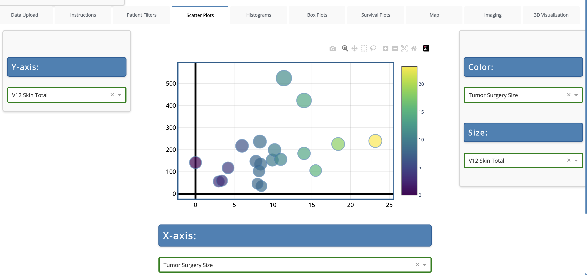
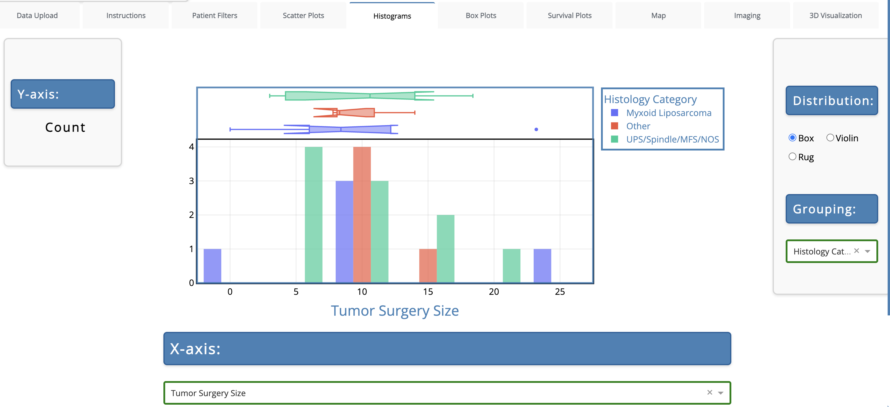
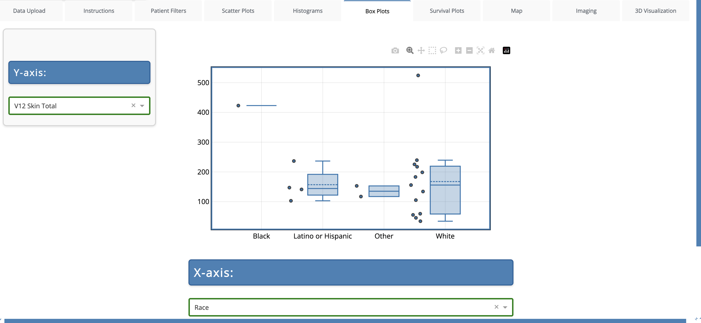
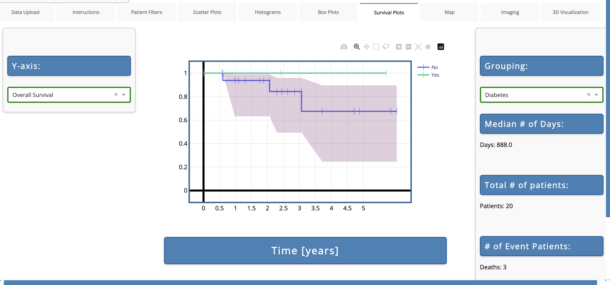
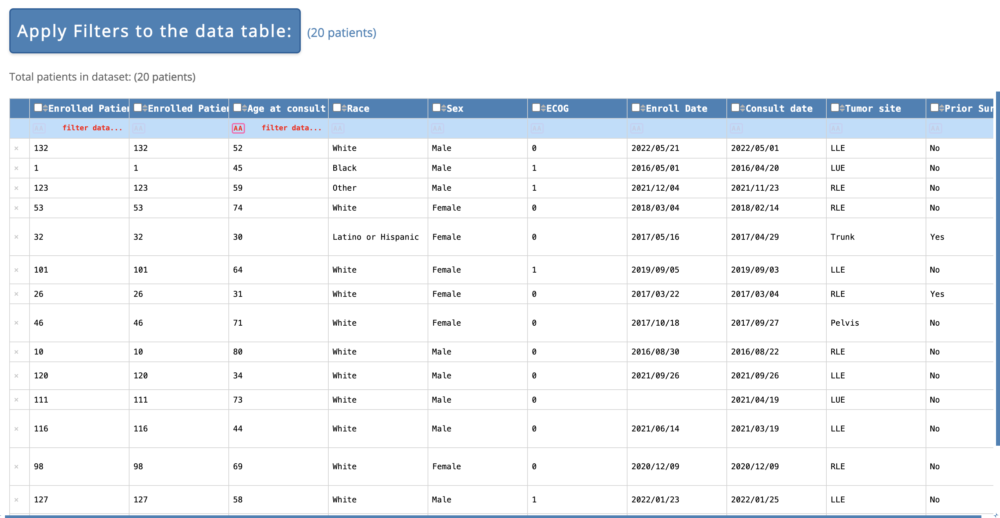
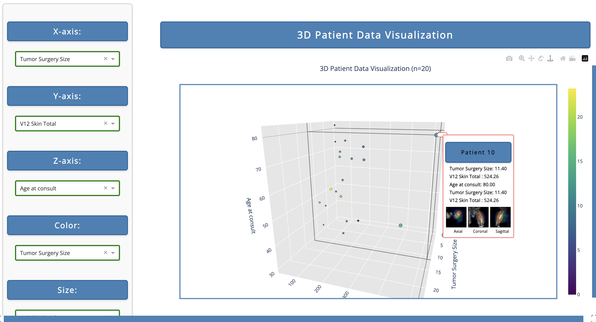
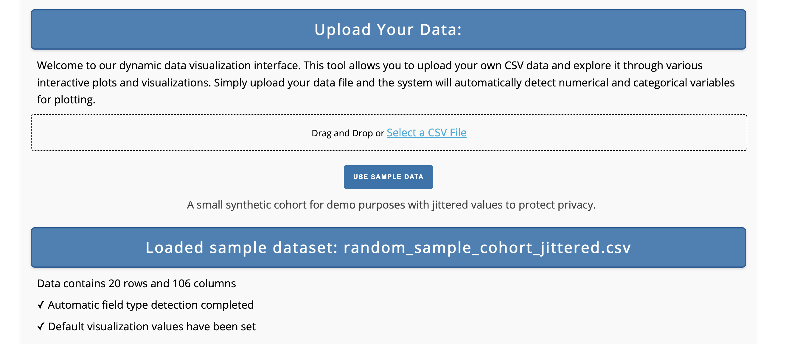

# VisionOnc: A Dynamic Data Visualizer for Oncology


## Overview

VisionOnc is an interactive, browser-based data visualization tool designed for exploration of clinical datasets without the need of extensive programming knowledge. Using anonymized tabular data in the CSV format, the tool parses through data headers to infer variable types, dynamically filter data, and create meaningful and customizable data visualizations to suit user needs. 

This interactive visualization is designed with the aim of improving data accessibility, transparency, and hypothesis generation throughout clinical trials. As an example, the sample data this tool uses to demonstrate its features was taken from a recently ingested real-world clinical trial with spatial and temporal data jittering for anonymity. 


## Available Visualizations/Tools

- Dynamic data filtering
- Scatter Plot
- Histogram
- Box Plot
- Survival Plot
- Map
- 3D Scatter Plot









## Instructions for Using the Deployed Dashboard

1. Start on the data upload tab where you can upload your own CSV file or click the "Use Sample Data" button. Also make sure to examine the CSV upload instructions under the instructions tab for more information.



2. Once your data is uploaded, scroll down to double check that all of your fields are classified properly (Categorical, numerical, or datetime) and make sure to save any changes at the bottom if adjustments are made.

3. From there, navigate to any desired tab, and observe the visualizations shown. Any axis adjustments can be made through the corresponding drop down fields.

## Instructions for Launching Runnning the Code Locally

1. Download the repo and make sure to install python 3.12 and the associated requirements in the [requirements.txt](https://github.com/matthewru/VisionOnc/blob/main/requirements.txt) file
2. The [assets](https://github.com/matthewru/VisionOnc/tree/main/assets) folder should contain the associated assets file. This repo has the required assets for the sample.
3. Finally run the code below and click the URL the populates to run locally
3. Run the command below and click the generated URL to launch the app locally:

   ```bash
   python main.py
